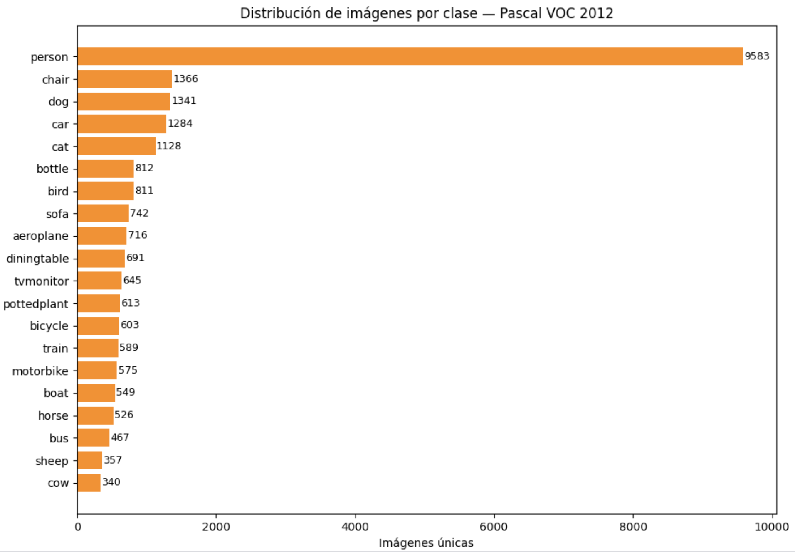
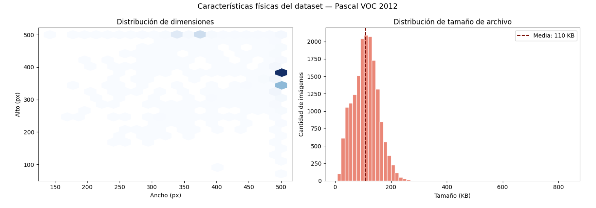
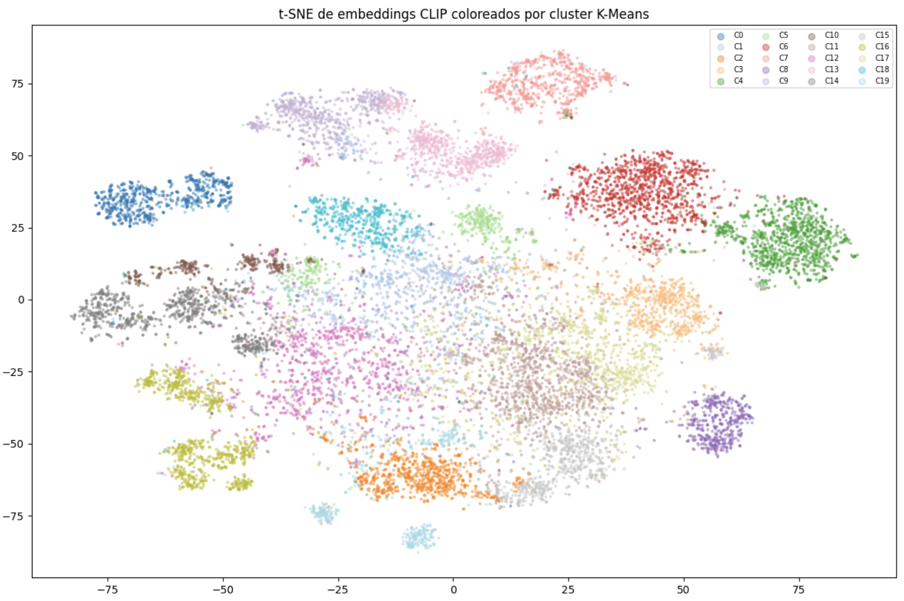
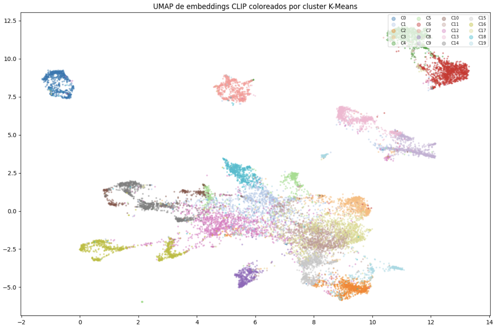
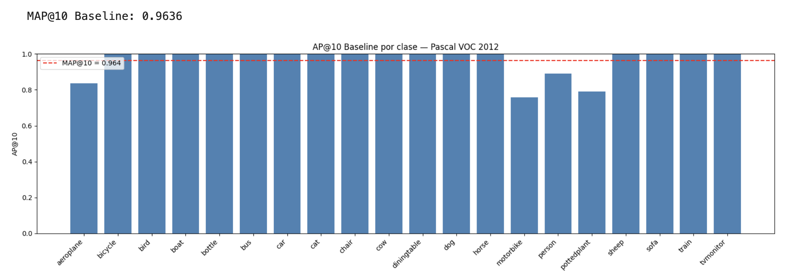
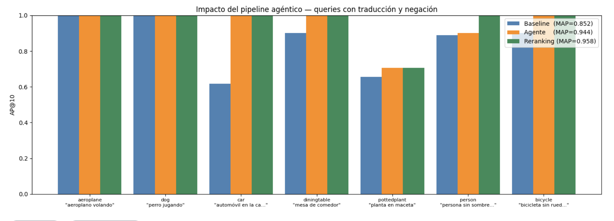
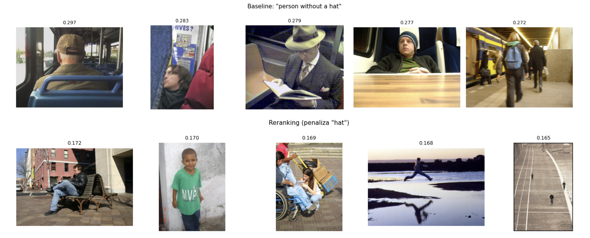
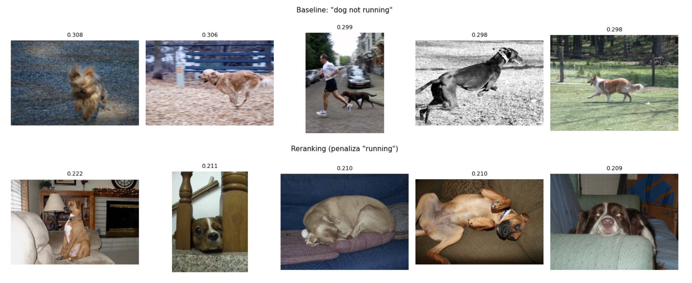

# Trabajo Práctico Integrador — Sistema de Búsqueda Multimodal de Imágenes

**Materia:** Inteligencia Artificial  
**Cátedra:** 5k3  
**Cuatrimestre:** Otoño 2026  
**Grupo:** 20  
**Integrantes:**
- Ceballos, Juan Cruz — 94239
- Estrada Uriz, Mateo — 95556
- Witt, Facundo Jeremías — 97848
- Stanglino, Santiago — 98577 

---

## 1. Análisis del Dataset (EDA, Exploratory Data Analysis)

Pascal VOC 2012 es un dataset que contiene 17125 imágenes y una anotación para cada una de ellas (archivo que indica qué objetos y a cuál de las categorías pertenecen), donde identificamos que todos los objetos estan comprendidos dentro de 20 categorías: personas, animales, vehículos e interiores. 
Este dataset es ampliamente usado para evaluar modelos de detección y segmentación de objetos.

### 1.1 Estadísticas básicas

Al explorar el dataset encontramos que las imágenes tienen dimensiones variables pero con una fuerte concentración alrededor de 500×375 píxeles y su transpuesta (375×500). Todas las imágenes son RGB (3 canales).

| Métrica | Valor |
|--------|-------|
| Total de imágenes | 17125 |
| Clases únicas | 20 |
| Total de objetos anotados | 40138 |
| Canales | 3 (RGB) |
| Ancho promedio (px) | 466.80 |
| Alto promedio (px) | 389.51 |
| Tamaño promedio (KB) | 109.60 |
| Desbalance entre la clase más y menos frecuente | 28.2x  (person: 9583 vs cow: 340) |

### 1.2 Distribución por clases

La clase `person` es la más frecuente con amplia diferencia, lo que refleja que las fotografías cotidianas tienden a incluir personas. En el extremo opuesto se encuentran clases como `cow` o `sheep`. Este desbalance no afecta directamente al sistema de búsqueda ya que no entrenamos ningún clasificador, pero sí influye en cuántas imágenes relevantes existen para cada query al momento de evaluar el MAP@10.




### 1.3 Distribución de dimensiones y tamaño

El diagrama de dispersión (_scatter plot_) de dimensiones muestra claramente dos clusters: imágenes en orientación paisaje (500×375) y en orientación retrato (375×500). Hay pocos casos fuera de esas dos resoluciones dominantes. El histograma de tamaño de archivo muestra una distribución sesgada a la derecha, con la mayoría de las imágenes por debajo de los 200 KB.




## 2. Metodología

### 2.1 Pipeline general

El sistema recibe una consulta en lenguaje natural (en español o inglés) y devuelve las 10 imágenes más relevantes del dataset. Para eso, el pipeline la procesa en hasta 6 etapas antes de ejecutar la búsqueda:

1. **Detección de idioma** — se analiza el texto buscando marcadores léxicos del español (artículos, preposiciones, caracteres con tilde). Si se detecta español, se activa la traducción; si no, la query pasa directa.
2. **Traducción ES→EN** — CLIP fue entrenado predominantemente en inglés, por lo que traducir mejora significativamente la calidad de los embeddings de texto. Se usa MarianMT, un modelo liviano de traducción neuronal.
3. **Detección de negaciones** — se buscan palabras de negación en la query traducida (como *without*, *not*, *never*, *sin*, *nunca*).
4. **Manejo de negaciones** — si se detecta una negación, se usa aritmética de embeddings para desplazar el vector de búsqueda lejos del concepto no deseado. El pipeline termina acá para no agregar ruido con expansiones adicionales.
5. **Expansión de sinónimos** — para queries sin negación, Flan-T5 genera una reformulación alternativa con vocabulario diferente para enriquecer semánticamente la búsqueda.
6. **Verificación de integridad** — antes de usar la reformulación, se mide la similitud coseno entre sus embeddings CLIP y los de la query original. Si la similitud cae por debajo de 0.75, se descarta la expansión.

La búsqueda final combina todas las variantes generadas y fusiona los resultados tomando el score máximo por imagen.

### 2.2 Embeddings e indexación (baseline)

Un **embedding** es una representación numérica (un vector) que captura el contenido semántico de una imagen o texto, de modo que elementos parecidos quedan cerca en el espacio vectorial.
Cada imagen del dataset fue codificada con CLIP (_Contrastive Language–Image Pre-training_) como un embedding de 512 dimensiones y almacenada en un índice FAISS (_Facebook AI Similarity Search_), una librería que permite realizar una búsqueda eficiente por similitud entre vectores.

| Componente | Decisión | Justificación |
|-----------|---------|--------------|
| Modelo de embeddings | CLIP ViT-B/32 | Buena relación calidad/velocidad, preentrenado en 400M pares imagen-texto |
| Dimensión de embeddings | 512 | Fija por la arquitectura ViT-B/32 |
| Índice FAISS | IndexFlatIP | Búsqueda exacta por producto interno; suficiente para 17K imágenes sin necesidad de aproximaciones |
| Métrica de similitud | Producto interno (coseno sobre vectores L2-normalizados) | Equivalente a similitud coseno una vez que los vectores están normalizados |

Los embeddings de imágenes se precalcularon una sola vez y se guardaron en disco para evitar recalcularlos en cada ejecución. La normalización L2 se aplica antes de indexar para que el producto interno sea equivalente a la similitud coseno.

### 2.3 Clustering exploratorio con embeddings CLIP

Para explorar si los embeddings de CLIP capturan estructura semántica en el dataset, aplicamos K-Means con k=20 (igual que la cantidad de clases VOC) y visualizamos los resultados con t-SNE y UMAP.

**K-Means (k=20):**

| Métrica | Valor |
|--------|-------|
| Cluster más poblado | **1465** imágenes |
| Cluster menos poblado | **380** imágenes |
| Desbalance | **3.9**x |

Tanto t-SNE como UMAP muestran que los embeddings de CLIP forman agrupaciones diferenciadas, lo que indica que el modelo separa semánticamente los distintos tipos de imágenes sin haber sido entrenado específicamente sobre VOC. UMAP preserva mejor la estructura global del espacio y produce clusters más compactos, mientras que t-SNE resalta mejor las vecindades locales.







---

### 2.4 Componente agéntico — LLMs livianos

Se integraron dos modelos de lenguaje para las etapas de traducción y reformulación. Ambos son lo suficientemente livianos para correr en CPU sin tiempos prohibitivos.

| Tarea | Modelo | Parámetros |
|------|--------|-----------|
| Traducción ES→EN | Helsinki-NLP/opus-mt-es-en (MarianMT) | ~74M |
| Expansión de sinónimos | google/flan-t5-base | ~250M |

MarianMT fue elegido por ser un modelo de traducción neuronal específico para el par ES→EN, rápido y con buena calidad para texto de dominio general. Flan-T5 fue elegido sobre alternativas más grandes (como TinyLlama) porque es capaz de seguir instrucciones con prompts simples y corre en CPU en tiempos razonables.

### 2.5 Manejo de negaciones

CLIP fue entrenado con descripciones afirmativas de imágenes, por lo que tiende a ignorar palabras como *without* o *not* y se enfoca en los conceptos visuales dominantes del texto. Para compensar esto implementamos dos mecanismos complementarios:

**Aritmética de embeddings (tiempo de query):**

```
embed_final = embed(positivo) − λ · embed(negado)
```

Se separa la query en su parte positiva y negada, se codifican por separado y se resta el embedding del concepto no deseado con un peso λ. Esto desplaza el vector de búsqueda hacia regiones del espacio semántico que están lejos del concepto negado.

**Reranking post-retrieval:**

Se recupera un pool de 50 candidatos y se re-puntúa cada imagen penalizando las que tienen alta similitud con el concepto negado:

```
score_final = score_original − λ · sim(imagen, concepto_negado)
```

Los dos mecanismos son complementarios: la aritmética actúa sobre la query antes de buscar, y el reranking filtra los resultados residuales que igual aparecen.

- **λ (embedding arithmetic):** 0.3
- **λ (reranking penalty):** 0.4
- **Pool para reranking:** 50 resultados

### 2.6 Verificación de integridad

En lugar de confiar en que el LLM genere siempre reformulaciones coherentes, verificamos la calidad de cada expansión antes de usarla. Medimos la similitud coseno entre el embedding CLIP de la query original y el de la reformulación propuesta por Flan-T5. Si esa similitud cae por debajo de 0.75, la expansión se descarta y se usa directamente la query traducida.

Esta decisión de diseño evita que una expansión semánticamente alejada contamine los resultados. Resultó importante en la práctica porque Flan-T5 a veces genera alternativas demasiado genéricas o que derivan del tema original.

- **Umbral de similitud coseno:** 0.75
- **Acción si no se supera:** se descarta la expansión y se usa la query traducida sin modificar

---

## 3. Resultados

### 3.1 Evaluación baseline — 20 clases VOC

Para evaluar el baseline evaluamos las 20 clases de VOC como queries directas en inglés. La métrica usada es AP@10 (Average Precision at 10), que pondera más los aciertos que aparecen primero en el ranking. El MAP@10 es el promedio de AP@10 sobre todas las clases.

**MAP@10 Baseline: 0.964**

El resultado es alto, lo que era esperable: CLIP fue entrenado con millones de pares imagen-texto en inglés, y las clases de VOC son conceptos visuales simples y frecuentes en ese tipo de datos. 16 de las 20 clases obtienen AP@10 = 1.0, es decir que los primeros 10 resultados son todos de la clase correcta.




Las tres clases con menor AP revelan limitaciones concretas del modelo:

| Clase | AP@10 | Posible causa |
|------|-------|--------------|
| aeroplane | 0.835 | CLIP reconoce mejor "airplane" que "aeroplane" (diferencia de vocabulario en el entrenamiento) |
| motorbike | 0.757 | Similar al anterior: "motorcycle" es más frecuente en los datos de entrenamiento |
| pottedplant | 0.790 | Concepto multipalabra poco frecuente; imágenes visualmente similares a otras plantas o fondos naturales |

### 3.2 Comparación baseline vs agente — queries con traducción y negación

Para evaluar el impacto del pipeline agéntico, probamos 7 queries en español y comparamos el AP@10 en tres configuraciones:

- **Baseline** — la query en español se pasa directamente a CLIP sin ningún procesamiento. CLIP no entiende bien el español, por lo que los resultados son peores.
- **Agente** — la query pasa por el pipeline completo: detección de idioma, traducción al inglés, expansión con sinónimos y verificación de integridad. CLIP recibe texto en inglés y funciona significativamente mejor.
- **Reranking** — sobre el pool de resultados del agente se penalizan las imágenes con alta similitud al concepto negado. Solo tiene efecto real en queries que contienen negación, como "persona sin sombrero" o "bicicleta sin ruedas".

| Query | AP Baseline | AP Agente | AP Reranking |
|-------|------------|-----------|-------------|
| "aeroplano volando" | 1.000 | 1.000 | 1.000 |
| "perro jugando" | 1.000 | 1.000 | 1.000 |
| "automóvil en la calle" | 0.616 | 1.000 | 1.000 |
| "mesa de comedor" | 0.900 | 1.000 | 1.000 |
| "planta en maceta" | 0.656 | 0.707 | 0.707 |
| "persona sin sombrero" | 0.890 | 0.900 | 1.000 |
| "bicicleta sin ruedas" | 0.900 | 1.000 | 1.000 |
| **MAP@10** | **0.852** | **0.944** | **0.958** |

La ganancia más importante sobre el baseline viene de la traducción: queries como "automóvil en la calle" pasan a "car on the street", lo que permite que CLIP opere en el idioma en el que fue entrenado. La expansión de sinónimos agrega una mejora adicional más modesta.



### 3.3 Queries complejas (múltiples conceptos)

Para queries que involucran múltiples objetos simultáneos, construimos un conjunto de respuestas correctas (_ground truth_) como la intersección de las imágenes VOC que contienen todos los componentes de la query. Por ejemplo, para "person riding a horse" el GT son las imágenes anotadas tanto con `person` como `horse`.

| Query | GT (imágenes) | AP Baseline | AP Agente |
|-------|--------------|------------|----------|
| "person riding a horse" | 263 | 0.2495 | 0.2495 |
| "person on bicycle" | 346 | 0.2600 | 0.3627 |
| "dog and cat together" | 35 | 0.7764 | 0.7764 |
| "car and bus on the road" | 181 | 0.2711 | 0.2711 |
| "bird near a boat" | 12 | 0.1400 | 0.1333 |
| **MAP@10** | — | **0.3394** | **0.3586** |

El MAP@10 cae considerablemente respecto al baseline de clases simples. Esto no refleja un fallo del sistema sino la dificultad intrínseca del problema: encontrar imágenes que contengan dos objetos específicos simultáneamente es mucho más restrictivo. El caso con mejor resultado fue "dog and cat together" porque perros y gatos suelen co-ocurrir en fotografías domésticas.

### 3.4 Impacto del reranking en negaciones

Para medir el efecto del reranking en queries negadas usamos métricas indirectas, dado que VOC no tiene anotaciones de ausencia de atributos. Observamos cuántas imágenes nuevas entran al top-10 tras el reranking y si el score promedio baja (lo cual es esperable y deseable: estamos penalizando imágenes con el concepto no deseado).

| Query | Score promedio baseline | Score promedio reranking | Imágenes nuevas en top-10 |
|-------|------------------------|-------------------------|--------------------------|
| "person without a hat" | 0.2756 | 0.1661 | 10/10 |
| "dog not running" | 0.2975 | 0.2096 | 10/10 |


Que el score promedio baje después del reranking es una señal positiva: el sistema está efectivamente desplazando hacia afuera del top-10 las imágenes con mayor similitud al concepto negado, aunque no podemos cuantificar la precisión exacta sin un ground truth manual.

**Ejemplos visuales — baseline vs reranking:**





---

## 4. Discusión y Análisis Crítico

### 4.1 Qué funcionó bien

La parte que mejor funcionó fue la búsqueda baseline con CLIP sobre las 20 clases de VOC. Un MAP@10 de 0.964 con un sistema completamente zero-shot muestra que los embeddings de CLIP son lo suficientemente buenos para este tipo de búsqueda directa. No hubo que entrenar nada ni ajustar parámetros para ese caso.

La traducción también tuvo un impacto claro y consistente. Queries en español que describían la misma clase VOC siempre mejoraron al pasar por MarianMT, lo que confirma que CLIP funciona mejor cuando el texto está en el idioma de su entrenamiento.

La verificación de integridad resultó útil en la práctica: en varios casos Flan-T5 generó reformulaciones demasiado genéricas o alejadas del tema original, y el mecanismo de similitud coseno las descartó correctamente antes de que pudieran degradar los resultados.

### 4.2 Qué no funcionó o tuvo resultados mixtos

El manejo de negaciones fue el aspecto más difícil. Tanto la aritmética de embeddings como el reranking logran mejorar visualmente los resultados en algunos casos, pero la mejora no es consistente. CLIP no fue diseñado para entender negaciones gramaticales, y restar un embedding no es lo mismo que excluir un concepto visualmente, especialmente cuando el concepto negado aparece en un contexto diferente al que queremos evitar.

Las queries complejas con múltiples objetos también mostraron resultados mixtos. El sistema trata la query como una sola descripción y no la descompone en componentes, por lo que depende de que CLIP haya visto suficientes ejemplos de esa co-ocurrencia durante su entrenamiento.

### 4.3 Limitaciones del enfoque

La limitación más importante es que CLIP no procesa negaciones gramaticales. Palabras como *without* o *not* son prácticamente ignoradas durante la codificación del texto porque el modelo fue entrenado mayormente con descripciones afirmativas. Nuestra compensación con aritmética de embeddings es una aproximación que funciona parcialmente pero no resuelve el problema de fondo.

Otra limitación es la ausencia de ground truth para queries negadas en VOC. El dataset no registra la ausencia de atributos, por lo que no pudimos calcular métricas de precisión para esos casos y tuvimos que conformarnos con métricas indirectas.

Finalmente, el ground truth para queries complejas que usamos (intersección de clases) es una aproximación: que una imagen tenga anotados `person` y `horse` no implica necesariamente que muestre a una persona montando un caballo.

---

## 5. Trabajo Futuro

Varias ideas quedaron fuera del alcance de este trabajo por tiempo o recursos. La más directa sería usar un modelo CLIP más grande (como ViT-L/14), que produce embeddings de mayor calidad para tareas de retrieval. También sería interesante reemplazar el reranking lineal por un modelo cross-encoder entrenado específicamente para re-puntuar pares imagen-texto, lo que permitiría penalizar negaciones con mayor precisión.

Para el problema de las negaciones, una mejora concreta sería anotar manualmente un subconjunto de imágenes VOC con queries del estilo "X sin Y" y usarlo como conjunto de evaluación, lo que permitiría medir el impacto real de cada estrategia con métricas de precisión basadas en ground truth, en lugar de las métricas indirectas que usamos por la falta de anotaciones de ausencia.

En cuanto a las queries complejas, sería valioso descomponer automáticamente la query en sus componentes y combinar los embeddings de cada uno de forma ponderada, en lugar de codificar la frase completa como un único vector.


